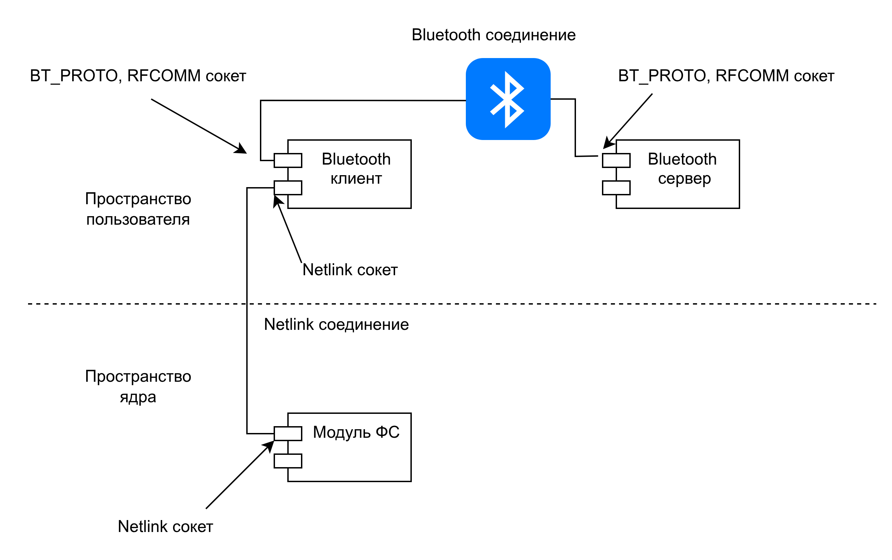

# BTFS — Bluetooth File System


**BTFS** (Bluetooth File System) — сетевая файловая система, которая позволяет монтировать удаленную директорию через Bluetooth-соединение как обычную файловую систему Linux. Проект состоит из клиентского и серверного компонентов, взаимодействующих через RFCOMM сокеты.

---

## 📖 О проекте

BTFS реализует клиент-серверную архитектуру для доступа к файлам по Bluetooth:

- **Сервер** (`btfs_server_daemon`) — запускается на устройстве, чьи файлы нужно предоставить. Работает как Bluetooth-сервер, обслуживает запросы клиентов.
- **Клиент** (`btfs_client_daemon`) — запускается на устройстве, которое хочет получить доступ к файлам. Взаимодействует с ядерным модулем.
- **Ядерный модуль** (`btfs_client_fs.ko`) — регистрирует файловую систему в Linux VFS, маршрутизирует системные вызовы через Netlink к клиентскому демону.
- **Клиентский демон** — транслирует Netlink-запросы от ядра в Bluetooth-запросы к серверу и обратно.

**Поддерживаемые операции:**
- Чтение/запись файлов
- Создание/удаление файлов и директорий
- Переименование
- Чтение директорий
- Получение/изменение атрибутов (права, владелец, размер)
- Блокировки файлов
- Символические ссылки
- Statfs (информация о файловой системе)

---

## ⚙️ Принцип работы

<p align="center">
  
</p>

1. **Сервер** запускается и начинает слушать RFCOMM-канал.
2. **Клиентский демон** подключается к серверу по Bluetooth.
3. **Ядерный модуль** регистрирует файловую систему `btfs`.
4. Пользователь монтирует `btfs` и работает с файлами как с обычными.
5. Все системные вызовы (read, write, open, mkdir и др.) перехватываются модулем и через Netlink отправляются демону.
6. Демон транслирует их в Bluetooth-запросы к серверу.
7. Сервер выполняет операцию и возвращает результат.

---

## 🗂️ Структура репозитория

```
.
├── btfs_client_fs.c              # Модуль ядра для клиента (VFS + Netlink)
├── btfs_client_daemon.c          # Пользовательский демон клиента
├── btfs_server_daemon.c          # Серверный демон (RFCOMM + файловые операции)
├── btfs_protocol.h               # Общие структуры данных и протокол
├── Makefile                      # Сборка проекта
└── README.md                     # Этот файл
```

---

## 🚀 Установка и запуск

### Требования
- Linux с поддержкой Bluetooth (BlueZ)
- Ядро Linux с установленными заголовками (`linux-headers-$(uname -r)`)
- Пакеты: `build-essential`, `libbluetooth-dev`

### Сборка

```bash
# Клонирование репозитория
git clone https://github.com/your-username/btfs.git
cd btfs

# Сборка всего проекта (модуль + демоны)
make all

# Или по отдельности:
make modules     # Только ядерный модуль
make daemons     # Только демоны
```

### Настройка Bluetooth

**На сервере:**
```bash
# Включить Bluetooth
sudo systemctl start bluetooth
sudo bluetoothctl power on

# Сделать устройство видимым
sudo bluetoothctl discoverable on
```

**На клиенте:**
```bash
# Найти MAC-адрес сервера
hcitool scan
# Пример вывода:  AA:BB:CC:DD:EE:FF  MyServer
```

### Запуск сервера

```bash
# Создать директорию для общего доступа
mkdir ~/btfs_share

# Запустить сервер
sudo ./btfs_server_daemon ~/btfs_share
```

### Запуск клиента

```bash
# Загрузить ядерный модуль
sudo make install_client
# или
sudo insmod btfs_client_fs.ko

# Запустить клиентский демон (подключиться к серверу)
sudo ./btfs_client_daemon AA:BB:CC:DD:EE:FF
```

### Монтирование файловой системы

```bash
# Создать точку монтирования
sudo mkdir /mnt/btfs

# Смонтировать BTFS
sudo mount -t btfs none /mnt/btfs

# Проверить
ls -la /mnt/btfs
```

### Остановка

```bash
# Размонтировать
sudo umount /mnt/btfs

# Остановить демоны (Ctrl+C)

# Выгрузить модуль
sudo make uninstall
# или
sudo rmmod btfs_client_fs
```

---

## 📊 Протокол обмена

### Формат заголовка (общий для RFCOMM и Netlink)

```c
struct btfs_header {
    uint32_t opcode;    // Код операции (см. btfs_protocol.h)
    uint32_t sequence;  // Уникальный номер запроса
    uint32_t client_id; // Идентификатор клиента
    uint32_t flags;     // Флаги
    uint32_t data_len;  // Длина данных после заголовка
};
```

### Основные операции

| Операция | Код | Назначение |
|----------|-----|------------|
| `BTFS_OP_GETATTR` | 1 | Получить атрибуты файла/директории |
| `BTFS_OP_READDIR` | 2 | Чтение содержимого директории |
| `BTFS_OP_STATFS` | 4 | Информация о файловой системе |
| `BTFS_OP_OPEN` | 10 | Открыть файл |
| `BTFS_OP_READ` | 11 | Чтение данных из файла |
| `BTFS_OP_WRITE` | 12 | Запись данных в файл |
| `BTFS_OP_CLOSE` | 13 | Закрыть файл |
| `BTFS_OP_FSYNC` | 14 | Сбросить данные на диск |
| `BTFS_OP_MKDIR` | 20 | Создать директорию |
| `BTFS_OP_RMDIR` | 21 | Удалить директорию |
| `BTFS_OP_CREATE` | 30 | Создать файл |
| `BTFS_OP_UNLINK` | 31 | Удалить файл |
| `BTFS_OP_RENAME` | 32 | Переименовать |
| `BTFS_OP_TRUNCATE` | 33 | Обрезать файл |
| `BTFS_OP_CHMOD` | 34 | Изменить права доступа |
| `BTFS_OP_CHOWN` | 35 | Изменить владельца |
| `BTFS_OP_SYMLINK` | 37 | Создать символическую ссылку |
| `BTFS_OP_READLINK` | 38 | Прочитать символическую ссылку |
| `BTFS_OP_LOCK` | 40 | Заблокировать файл |
| `BTFS_OP_UNLOCK` | 41 | Разблокировать файл |
| `BTFS_OP_PING` | 50 | Проверка связи |

---

## 🧪 Тестирование

```bash
# Проверить, что модуль загружен
lsmod | grep btfs

# Проверить Netlink
cat /proc/net/netlink | grep 31

# Проверить Bluetooth соединение
hcitool con

# Просмотр логов ядра
dmesg | tail -20
```
